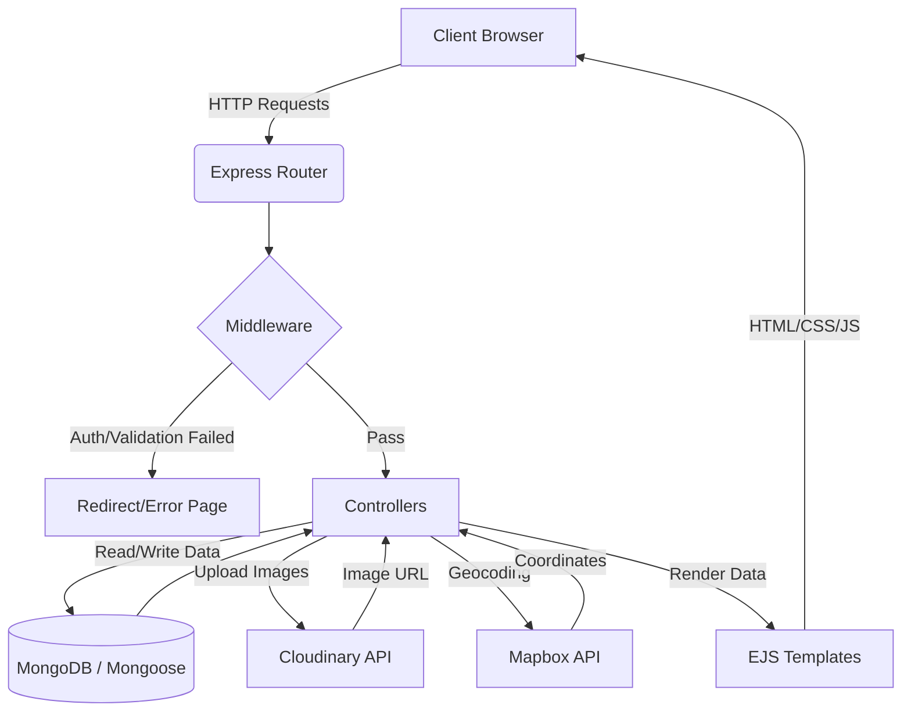
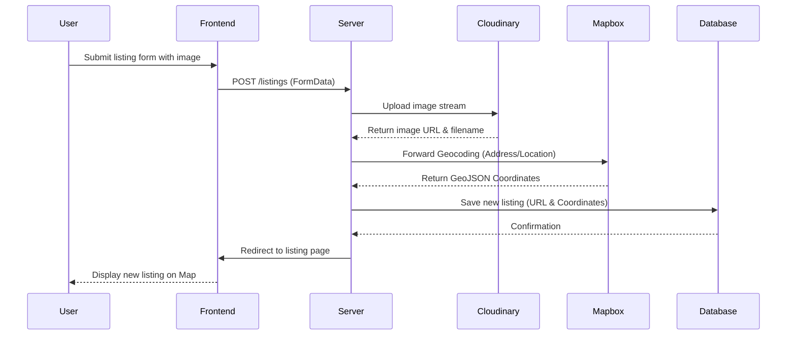

# Wonderlust

Wonderlust is a full-stack web application inspired by Airbnb. It provides a robust platform for users to discover, list, and manage unique travel accommodations worldwide. Built with modern web technologies, Wonderlust offers a seamless and secure user experience for both hosts and travelers.

## 🚀 Key Features

- **Authentication & Authorization**: Secure user registration, login, and session management using Passport.js. Role-based access control for listings and reviews.
- **Listings Management**: Full CRUD operations for properties. Users can create, edit, view, and delete their own accommodations.
- **Interactive Maps**: Integrated Mapbox for interactive and precise geographical property locations.
- **Cloud Image Storage**: Seamless and secure image uploads powered by Cloudinary.
- **Reviews & Ratings**: An interactive review system allowing users to leave ratings and comments on their stays.
- **Data Integrity & Security**: Server-side validation with Joi, helmet for setting HTTP response headers, and secure routing.
- **Responsive UI**: A fully responsive and aesthetic user interface built with Bootstrap and EJS templates.

## 🛠️ Tech Stack

- **Frontend**: HTML5, CSS3, JavaScript, Bootstrap, EJS (Embedded JavaScript), EJS-Mate
- **Backend**: Node.js, Express.js
- **Database**: MongoDB, Mongoose
- **Security & Authentication**: Passport.js, Helmet, Express-Session
- **Third-Party Integrations**: Cloudinary (Image Hosting), Mapbox (Geocoding & Maps)

## 📋 Prerequisites

Before you begin, ensure you have the following installed on your local machine:

- [Node.js](https://nodejs.org/) (v14 or higher recommended)
- [MongoDB](https://www.mongodb.com/) (running locally or a MongoDB Atlas URI)
- Cloudinary Account (for image uploads)
- Mapbox Account (for map features)

## ⚙️ Installation & Setup

1. **Clone the repository:**

   ```bash
   git clone https://github.com/raghuvanshi-sec/Wonderlust.git
   cd Wonderlust
   ```

2. **Install dependencies:**

   ```bash
   npm install
   ```

3. **Environment Configuration:**
   Create a `.env` file in the root directory and add your environment variables.
   *(Note: Ensure your `.env` file is never committed to version control)*

   ```env
   # Database Configuration
   DB_URL=<your-mongodb-connection-string>
   
   # Cloudinary Configuration
   CLOUD_NAME=<your-cloudinary-cloud-name>
   CLOUD_API_KEY=<your-cloudinary-api-key>
   CLOUD_API_SECRET=<your-cloudinary-api-secret>
   
   # Mapbox Configuration
   MAP_TOKEN=<your-mapbox-token>
   
   # App Configuration
   SECRET=<your-session-secret>
   PORT=<your-preferred-port>
   ```

4. **Initialize the database (Optional):**
   To seed the database with initial sample data:

   ```bash
   node init/index.js
   ```

5. **Run the application:**
   For development mode with auto-reload:

   ```bash
   npm run dev
   ```

   Or standard start:

   ```bash
   node app.js
   ```

6. **Access the application:**
   Check your terminal output for the local server URL. Open your browser and navigate to the port specified in your environment configuration (e.g., `http://localhost:<PORT>`).

## 📁 Project Structure

- `controllers/` - Core application logic and request handling
- `models/` - Mongoose database schemas (Listing, Review, User)
- `routes/` - Express route definitions
- `views/` - EJS templates and UI components
- `public/` - Static assets (CSS, JS, Images)
- `middleware.js` - Custom middleware for authentication and validation
- `utils/` - Utility classes and error handling functions
- `schema.js` - Joi validation schemas

## 🗺️ Architecture & Flow

### Application Data Flow



### Listing Creation Flow



## 📄 License

This project is open-source and available under the terms of the MIT License.
